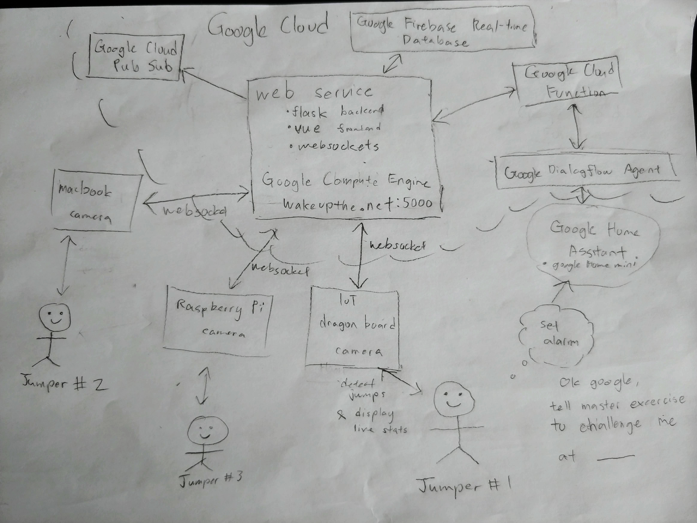

# Jump Awake

`Jump Awake` is an IoT solution that gets you physically active in the morning, winning the `Best Use of Google Cloud Platform` and `Best IoT Hack` prizes at `XdHacks 2019`.

Created by
- [Gordon Shieh](https://www.linkedin.com/in/gordon-shieh-73658796/)
- [Marshall Lu](https://www.linkedin.com/in/marshalllu/)
- [Nicholas Wu](https://nickwu241.github.io)

# Problem
Too many people are stuck in their beds, some also choose to repeatedly snooze their alarms, and many people want exercise but need that initial encouragement!

# Solution
Starting the day off early with improves your physical health and heightens your alertness.

Our IoT device is an alarm that requires you to do physical exercise routines such as jumping jacks, squats, burpees, sit ups in order to shut off the alarm.

To add additional motivation, we've gamified this experience to provide social motivation for users that's striving to wake up early by implementing:
- A live Competition mode for real-time activity tracking against an opponent
- A dashboard to show statistics for your activities
- A Google Home companion application to schedule your fitness alarm

## How does it work?
1. User has the IoT device (with webcam and screen attached) in their bedroom.
2. They set an alarm by saying `Okay Google, tell Master Exercise to challenge me at 8:00am`
3. At 8:00am, the alarm activates and the user will have to do jumping jacks to disable the alarm.

# Technology Used
Here's a rough picture of our architecure:



Our IoT devices include a `Qualcomm DragonBoard 410c` and `Raspberry Pi 3` with webcams and monitors attached to them. They run machine vision algorithms to detect the user's motions such as jumping jacks.
We implemented our activity detection using 2 different algorithms:
- OpenCV Haar Casscades on low-compute devices such as our IoT devices
- Caffe Based Face Detector which uses a Deep Neural Net algorithm that detects more accurately for devices with more compute such as a laptop

Our web service uses web-sockets for real-time communication, leveraged `Vue` for frontend and `Flask` for the backend.

Finally, we leveraged Google's services by using
- `Google Compute Engine` to host our web service
- `Firebase Real-time Database` to store alarm times, statistics and time series data for physical activity
- `Google Cloud Functions` to run workloads such a scheduling alarms
- `Google Dialogflow Agent` to facilitate interactions with `Google Assistant`
- `Google Assistant` to control the device via voice
- `Google Home Mini` as the hardware running `Google Assistant`

# Development
## Running the services locally
Running the server locally requires the Firebase admin credentials `firebase-sa-secret.json` to interact with the database.
```sh
# Install the dependencies if you haven't
pipenv install

# Run the app on localhost:5000 with hot reload and debug
pipenv run ./app.py
```

```sh
# Developing for the frontend
cd frontend

# Install the dependencies if you haven't
npm install

# Run the frontend on localhost:8080 with hot reload and proxying to localhost:5000
npm run serve
```

```sh
# Requires Firebase CLI, you can install via: npm install -g firebase CLI
# Requires login: firebase login
# Then you can serve the Google cloud function locally, see CLI output for the URL
firebase serve
```

## Deploying the web service to Google Cloud Platform
```sh
# Initialize terraform once
terraform init

# Create resources for the demo
terraform apply

# Package the frontend to be statically served via the backend
./frontend/create_build.sh

# Transfer production files to the Google Compute virtual machine
./sync.sh

# SSH into the Google VM and start the server
./remote_start_server.sh

# Clean up Google resources after the demo to avoid paying $
terraform destroy
```